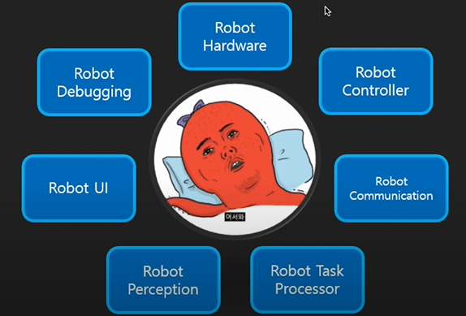

# ROS란?
**로봇 운영체제**(ROS, Robot Operating System)는 로봇 응용 프로그램을 개발할 때 필요한 하드웨어 추상화, 하위 디바이스 제어, 일반적으로 사용되는 기능의 구현, 프로세스간의 메시지 패싱, 패키지 관리, 개발활견에 필요한 라이브러리와 다양한 개발 및 디버깅 도구를 제공한다. ROS는 로봇 응용 프로그램 개발을 위한 운영체제와 같은 로봇 플랫폼이다. 하드웨어 플랫폼을 하드웨어 추상화로 포함하고 있으며, 로봇 응용 소프트웨어 개발 지원을 위한 소프트웨어 플랫폼이면서 이기종의 하드웨어에서 사용 가능한 운영체제와 같은 기능을 갖추고 있다.

쉽게 말하자면 로봇운영시스템이라고는 하지만 OS가 아닌 로봇과 로봇 사이의 통신을 만들어주거나, 로봇과 센서의 통신을 이어주거나, 사람들의 코드(오픈소스)와 쉽게 연동(통신)시켜주는 도구라고 생각하면 된다.

# ROS가 왜 필요한가?
**기존 로봇 개발 방식과 한계**
- 하드웨어 설계, 제어부터 제어기, 비전, 네비게이션 등 모든것을 개발해야 함.
- API마다의 interface가 다르고, 적용하는 데 학습이 필요함.
- 하드웨어에 의존적인 소프트웨어적 성격 때문에 로봇이 달라지면 소프트웨어 또한 수정이 필요함.
- 소프트웨어를 작성하는데 하드웨어에 대한 지식이 필요함.
- 디버깅을 하기 위해 디버깅 툴을 작성하거나 디버깅 API 코드를 삽입해야하 함.
- OS에 의존적이어서 변경이 어렵거나 불가능함.
- 멀티PC, 로봇을 구성하는 경우 통신구축, 검증에 많은 시간을 소비해야 함.

# 로봇 소프트웨어 플랫폼의 필요성
플랫폼이 있으므로 다음과 같은 변화가 생긴다.
- 하드웨어 인터페이스의 통합
- 하드웨어 추상화 - 규격화 - 모듈화
- 가격은 Down, 성능은 Up
- 하드웨어, 미들웨어(OS), 소프트웨어로 분리
- 사용자 수요에 맞는 서비스에 집중
- 사용자의 증가 -> 피드백 반영 -> 개선 -> 사용자의 증가 == 생태계 형성

[출처 - https://www.youtube.com/watch?v=o7z2HAUJncY]

로봇을 위해 필요한 업무나 기술이 많기 때문에 컴퓨터나 휴대폰처럼 플랫폼 도입의 필요성을 느낌.

# 로봇 소프트웨어 플랫폼의 장점
- 높은 프로그램 재사용성
- 통신 기반 프로그램
- 개발도구 지원
- 활성화된 커뮤니티 (오픈소스와 같이 같은 고민을 해본 사람이 많으면 문제의 해결도 빠름)
- 생태계 조성

# 로봇 소프트웨어 플랫폼의 종류
- NAOqi (유명하다. 페퍼에 들어가는 OS라고 함. 상용 플랫폼. 정보가 제한적이나 유저가 많고 앱 마켓이 있어 로봇 테스크를 다운받는 시스템이 있는 장점)
- OPROS (사용자가 없다는 단점)
- RT (사용자가 없다는 단점)
- **ROS:**
    - 장점:
    1. 무료
    2. 사용자가 가장 많음
    3. 활성화된 커뮤니티
    4. 오픈소스
    5. 기존 프로그램을 ROS에 이식하기 쉬움
    - 단점:
    1. 단일 로봇을 위한 솔루션
    2. 높은 PC의 연산 능력을 요구
    3. 네트워크에 의존성이 높음
    4. 보장되지 않는 실시간성
    5. 임베디드 시스템에서 사용하기 어려움
    6. 리눅스 위주의 개발과 패키지의 공개 등
    ==> 단점 보완을 위해 ROS를 개발하고 있음

# ROS의 목적
- 기존의 PC와 Phone의 역사를 Robot에 반영시키기 위한 생태계 형성
- 전세계 사람들이 모여 ROS를 함께 개발 (오픈소스 사용, 역할분담식으로 잘하는거 하자~)

# ROS의 특징
- Node간 메시지 교환 방식으로 프로그램을 잘게 나누어 공동으로 개발이 가능
- 도구지원: 명령어 도구, 시각화 도구, GUI 도구, 시뮬레이션 도구
- 로보틱스에서 사용하는 데이터의 규격화
- 모델링, 센싱, 인식, 네비게이션, 매니퓰레이션 기능의 지원
- 크게 형성된 WIKI (생태계)

ROS를 통해 로봇 소프트웨어 플랫폼의 필요성을 충족시킬 것이다.

## 🔗 참고 자료
- [Blog] ROS란 / 왜 ROS를 배워야 하는가? / 다른 로봇 플랫폼은?
- [YouTube] [ROS Tutorial] 1. ROS의 필요성 (세미나 영상)