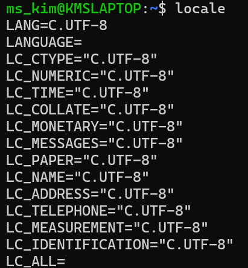
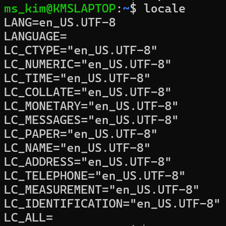

# 1. ROS2 설치
원래 Ubuntu 깔고 오면 ROS2를 설치하자. 나는 Ubuntu 24.04와 짝꿍(?)인 ROS2 Jazzy를 쓰려고 한다. 참고로 Humble과 Jazzy는 같은 ROS 2 라인업이라서 기본 명령어(Topic, Service, Action 등)와 파이썬/C++ 코드가 거의 100% 호환된다고 한다. ROS2 설치에 대한 공식 문서는 다음 사이트를 참고하길 바란다.

https://docs.ros.org/en/humble/Installation/Ubuntu-Install-Debs.html#

# 2. Locale 설정
Locale은 우분투 OS의 언어, 지역 설정, 숫자 표기 방식 등을 정의하는 설정값들의 집합이다. 즉, 컴퓨터가 어떤 언어로 사용자와 소통하고, 어떤 형식으로 데이터를 표현할지를 결정하는 설정이다. Ubuntu 터미널을 열고 다음과 같이 입력하자.
```bash
locale  # check for UTF-`8`
sudo apt update && sudo apt install locales
sudo locale-gen en_US en_US.UTF-8
# 시스템 전체의 기본 언어 설정을 '미국 영어(UTF-8)'로 영구적으로 변경
sudo update-locale LC_ALL=en_US.UTF-8 LANG=en_US.UTF-8
# 현재 켜져 있는 이 터미널 창에만 즉시 '미국 영어' 설정을 적용
export LANG=en_US.UTF-8
```
터미널에서 한글이나 영어가 깨지지 않게 하고 데이터 인코딩 형식을 UTF-8로 통일해서 통신 오류를 막기 위해 위 과정을 거쳤다.
설정된 locale을 확인하기 위해서 터미널에 다음과 같이 입력한다.
```bash
locale # verify settings
```
Before



After



# 3. apt 저장소 설정
우분투 OS에 ROS2 apt 저장소를 추가해야 하는데 먼저 Ubuntu Universe 저장소가 활성화 되어 있는지 확인한다.
```bash
# 1. 저장소 활성화
sudo apt update && sudo apt install software-properties-common
sudo add-apt-repository universe
```

이제 apt를 사용하여 ROS2 GPG 키를 추가한다. 이 과정은 ROS2를 설치하기 전에 ROS2 패키지를 안전하게 설치하기 위해 개발자의 "디지털 서명"이라고 할 수 있는 GPG 키를 추가하는 과정이다.
```bash
# 2. ROS 2 GPG 보안키 추가
sudo apt update && sudo apt install curl -y
sudo curl -sSL https://raw.githubusercontent.com/ros/rosdistro/master/ros.key -o /usr/share/keyrings/ros-archive-keyring.gpg
```

그런 다음  소스 목록에 ROS2용 apt 저장소를 추가한다.
```bash
# 3. 저장소를 내 시스템 목록에 추가
echo "deb [arch=$(dpkg --print-architecture) signed-by=/usr/share/keyrings/ros-archive-keyring.gpg] http://packages.ros.org/ros2/ubuntu $(. /etc/os-release && echo $VERSION_CODENAME) main" | sudo tee /etc/apt/sources.list.d/ros2.list > /dev/null
```

# 4. ROS2 패키지 설치
저장소 설정이 끝이 난 후에는 우부투 apt 저장소의 캐시를 업데이트 한다. ROS2 패키지가 설치되는 우분투 OS는 자주 업데이트가 되므로, 새 패키지를 설치하기 전에 시스템이 최신 상태인지 확인하는 것이 좋다. 그래서 update와 upgrade를 패키지 설치하기 전에 실행한다. upgrade는 시간이 좀 걸릴 수 있다.

```bash
sudo apt update
sudo apt upgrade
```

apt 저장소에 대한 설정이 끝이나면 apt 명령을 통해서 ROS2 Jazzy 버전을 설치한다.
```bash
# 1. 데스크톱 버전 (GUI 툴 포함, 공부용으로 가장 추천)
sudo apt install ros-jazzy-desktop

# 2. 베이스 버전 (이미 위에서 데스크톱을 설치했다면 생략해도 됨)
sudo apt install ros-jazzy-ros-base

# 3. 개발 도구 모음 (컴파일러 등 필수 도구)
sudo apt install ros-dev-tools
```

ROS2 Jazzy 패키지는 패키지 본체인 ros-jazzy-desktop, 각종 라이브러리/유틸리티 등을 내장한 ros-jazzy-ros-base, 그리고 컴파일러 등 도구모음인 ros-dev-tools로 구성된다.

# 5. 환경 설정
ROS2 Jazzy의 설치가 끝이나면, ROS2를 제대로 동작시키기 위해 다음 스크립트를 실행한다.

```bash
source /opt/ros/jazzy/setup.bash
```

이 스크립트는 터미널을 새로 실행할 때 마다 같이 실행해 주어야 해서 .bashrc 파일에 넣어서 사용한다. 터미널에서 vim 에디터를 열어서 .bashrc파일을 열고 위 스크립트 문구를 넣어준다. .bashrc는 중요한 파일이므로 신중하게 작업해야 한다.

```bash
echo "source /opt/ros/jazzy/setup.bash" >> ~/.bashrc
```
변경사항 현재 터미널에 즉시 적용
```bash
source ~/.bashrc
```

# 6. ROS2 예제 실행해보기
ROS2가 제대로 설치가 되었다면 아래와 같이 예제를 실행해 볼 수 있다. 터미널을 열고 아래의 명령을 입력해 본다. 이 에제는 talker - listner 예제로 "hello world" 문자열을 talker 프로그램이 송신을 하면, listener 프로그램이 이 문자열을 수신한다.

```bash
source /opt/ros/jazzy/setup.bash # bash 파일 설정했다면 pass
ros2 run demo_nodes_py talker
```

Talker 프로그램을 실행했으면 다른 터미널을 열고, 아래와 같이 입력하여 listener 프로그램을 실행한다.

```bash
source /opt/ros/jazzy/setup.bash # bash 파일 설정했다면 pass
ros2 run demo_nodes_py listener
```


예제 프로그램이 제대로 실행이 되었다면 talker가 실행된 터미널에서 "hello world" 문자열이 전송되고, listener 실행 터미널에서 그 문자열이 수신되는 것을 확인할 수 있다.

# 7. 문제 해결
ROS2를 설치하는 과정에서 문제가 발생하면 우선 아래의 URL을 확인해서 문제를 해결한다.

https://docs.ros.org/en/humble/How-To-Guides/Installation-Troubleshooting.html

# 8. 제거
ROS2를 설치한 후 문제가 발생하거나 업그레이드를 위해서 ROS2를 제거해야 할 경우, 다음 명령을 실행한다.
```bash
sudo apt remove ~nros-jazzy-* && sudo apt autoremove
```

저장소를 제거할 수도 있다.
```bash
sudo rm /etc/apt/sources.list.d/ros2.list
sudo apt update
sudo apt autoremove
```

# 9. ROS2 워크스페이스 설정
ROS2 workspace는 ROS2 패키지들을 모아두고 작업하는 디렉토리 구조를 의미한다. ROS2 프로젝트의 "작업 공간"으로, 사용자가 만들고 사용하는 모든 코드, 설정 파일, 그리고 패키지들이 이 워크스페이스 안에 모여 있다.

# 10. 워크스페이스의 주요 역할:
ROS2에서 워크스페이스의 주요 역할은 다음과 같다.
- **패키지 관리**: 여러 개의 ROS2 패키지를 한 곳에서 관리할 수 있음.
- **빌드**: 패키지를 빌드(컴파일)할 수 있는 환경을 제공
- **설치 및 실행**: 빌드된 파일을 실행하고 사용할 수 있도록 설정 가능

한 컴퓨터에 ROS2 워크스페이스는 여러 개를 만들 수 있다. 내가 한 우분투 컴퓨터에서 여러개의 ROS2 기반 로봇용 패키지를 만들고자 한다면 원하는 만큼 여러개의 워크스페이스를 만들 수 있고, 각각의 워크스페이스를 개별적으로 빌드 및 실행할 수 있다.

# 11. ROS2 워크스페이스의 기본 디렉토리 구조
ROS2 워크스페이스는 일반적으로 다음과 같은 폴더 구조로 이루어져 있다.
```bash
my_ros2_ws/     # 워크스페이스
├── src/        # 소스 디렉토리, 여기서 패키지를 만든다
├── build/      # 빌드한 파일들이 저장되는 디렉토리
├── install/    # 빌드 후 설치된 파일들이 저장되는 디렉토리
└── log/        # 빌드나 실행 과정에서 생성된 로그 파일
```
- `src/`: 사용자가 직접 작성하거나 사용하는 모든 ROS2 소스코드와 패키지들이 여기에 있음
- `build/`, `install/`, `log/`: 패키지를 빌드하고 실행하면서 생성된 파일들이 들어가는 디렉토리 

# 12. ROS2 워크스페이스 만들기
워크스페이스를 하나 만들자.
```bash
# -p 옵션을 사용하여 ros2_ws 디렉토리 하위 폴더로 src 디렉토리를 동시에 만든다.
mkdir -p ros2_ws/src
```

`src` 디렉토리까지 만들었으면 워크스페이스가 비어있지만 빌드를 한번 실행해서 워크스페이스 생성을 마무리 한다.
```bash
cd ros2_ws
colcon build
```

`colcon` 은 ROS2에서 패키지를 빌드하고 관리하기 위해 사용하는 빌드 도구이다. ROS2의 표준 빌드 시스템으로, 복잡한 프로젝트나 여러 패키지를 효율적으로 빌드할 수 있도록 도와준다.

주요 기능
- **패키지 빌드**: colcon은 ROS2 프로젝트의 여러 패키지를 한 번에 빌드할 수 있다. "build" 옵션을 사용하여 각 패키지를 의존성에 따라 순서대로 빌드하며, 병렬 빌드를 지원해 시간을 절약할 수 있다.
- **테스트 실행**: 빌드 후 패키지의 테스트도 실행할 수 있다. 
- **로깅 및 빌드 결과 관리**: 빌드 과정에서 발생하는 오류, 경고 등을 로그로 남기고, 빌드된 파일들을 install, build, log 디렉토리에 관리한다.

`colcon`을 사용하여 워크스페이스를 빌드했으면 다음 명령을 수행하여 빌드한 패키지를 사용할 수 있도록 환경을 설정한다.


```bash
# 꼭 워크스페이스 디렉토리에 수행하기
source install/setup.bash
```

colcon은 ROS2 설치과정에서 자동으로 설치되지만 만약 colcon 설치되어 있지 않앗다면 수동으로 설치해야 한다. colcon은 ROS2를 사용하기 위한 필수 도구이므로, ROS2를 설치한 후에 따로 설치하는 과정이 필요할 수 있다.

# 13. colcon 설치 방법
Ubuntu 리눅스 환경에서 `colcon`을 설치하려면 다음 명령어를 실행해야 한다.

```bash
sudo apt update
sudo apt install python3-colcon-common-extensions
```

`colcon`이 제대로 설치되었는지 확인하려면, 터미널에서 다음 명령어를 실행하여 버전을 확인할 수 있다.
```bash
colcon version-check
```

만약 `colcon`이 올바르게 설치되었다면, 버전 정보가 출력된다.

# reference
- https://wikidocs.net/265283
- https://docs.ros.org/en/jazzy/Installation/Ubuntu-Install-Debs.html